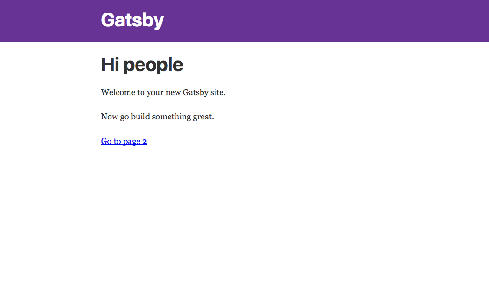

> 首先，gatsby属于比较新的东西，有学习的冲动。其次，gatsby是一个基于react的静态网站生成器，本人工作之初使用的技术栈也是react，因此使用其生态相关的方面也有益于成长。

## 如何一步步搭建gatsby的个人博客

### 搭建环境
首先安装gatsby的脚手架
```js
npm install -g gatsby-cli
```
然后一键生成目录结构并运行
```js
gatsby new [project name]
cd project
gatsby develop
```
现在你应该能看到下面的效果证明你的启动成功了



### 使用别人的模板
你可以从gatsby官网中学习如何从零搭建一个blog,今天我们讲个快的方式--使用别人的模版。

比如你想使用我这个网站的模板，你需要的步骤如下：
- 第一种方法：
  - git clone https://github.com/xypisces/Blog
  - npm i
  - gatsby develop
- 第二种方法：
  - gatsby new [project name] git@github.com:xypisces/Blog.git
  - gatsby develop

两种方法的前提你都要安装前面的脚手架，mac下的基本没出现问题，windows下会出现点问题，比如什么vs要升级到2005什么的，自行google解决，我就默认你启动成功啦

### 自定义修改样式
好了，现在你已经启动成功拥有这个项目，接下来可以为所欲为了。比如说我想这个背景颜色不好看想改，想加个搜索功能什么的。。

如果你有react基础的话，看下代码应该能够轻松修改。如果没有的话，我来简单介绍一下配置

```posts```文件下就是具体文章的内容啦，我已经放下一些样例文章提供参考啦

如果你要修改颜色的话，可以对应找这个文件```src/styles/colors.js```文件中修改。
然后在同层目录下```theme.js```中进行颜色的配置。

具体到页面结构的话```src/components```文件夹下具体看，命名已经很语义了哦。

### 发布到github pages
最后一步，发布到线上。如果你没有发布过github pages的话，建议去github官网中查看其文档使用，5分钟搞定，这里默认你成功建立一个自己的github pages。那么下面你只需要做：
- 第一步
```js
npm i gh-pages --save-dev
//然后在package.json的scripts中加上
"scripts":{
  ...,
  "deploy": "gatsby build --prefix-paths && gh-pages -d public"
}
```
- 第二步

在gatsby.config.js中设置的你项目地址，
```js
module.exports = {
  pathPrefix: `/project-name`,
}
```
这里面的project-name是这你的```https://github.com/username/project-name```中的```project-name```,如果你的访问地址是```username.github.io```的话，就直接是设置成```pathPrefix:'/'```即可。

- 第三步

```git remote -v```检查是否项目有链接到你线上地址中，如果没有的话，
首先```git init```,然后```git remote add origin git@github.com:username/project-name.git```. 最后运行```npm run deploy```即可。等几分钟你就能在线上看到你项目啦（如果没有请去项目地址查看，可能在另一分支上面，只是你需要合并一下就可以啦！）

### 总结
gatsby搭建blog和用hexo搭建blog的方法其实大同小异，而基于react,也方便了它的扩展性，总的来说还是推荐大家去使用一下的哦。