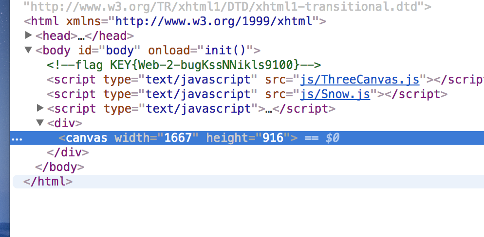
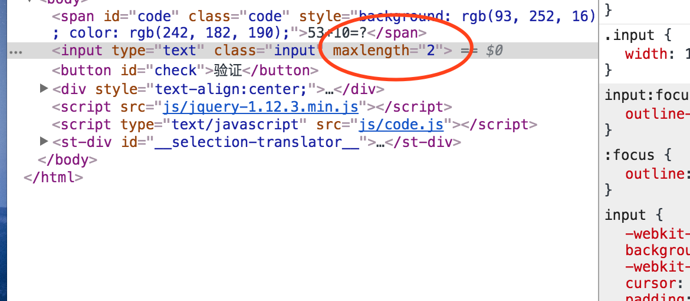
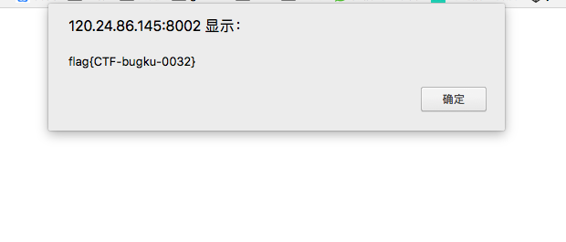
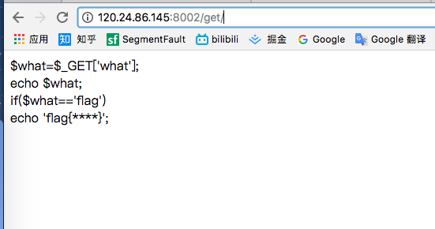
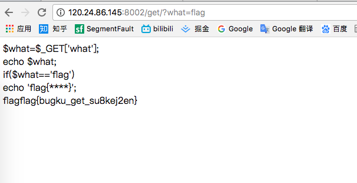
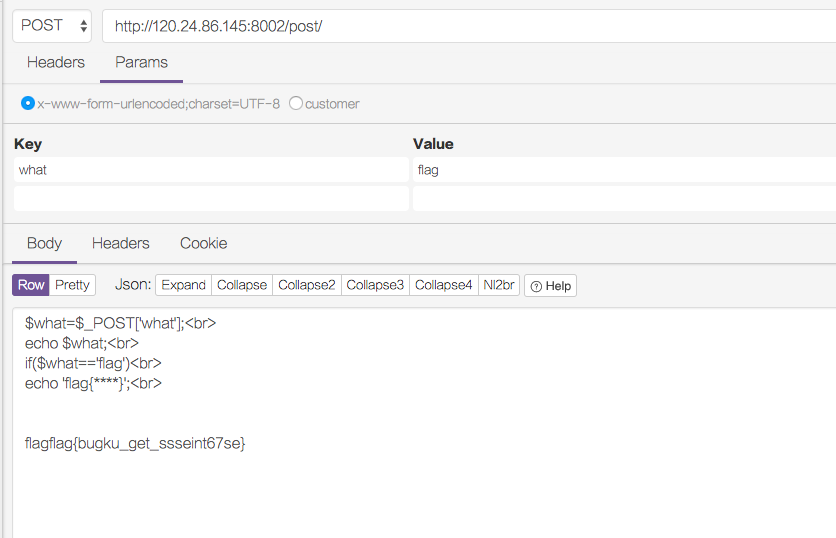
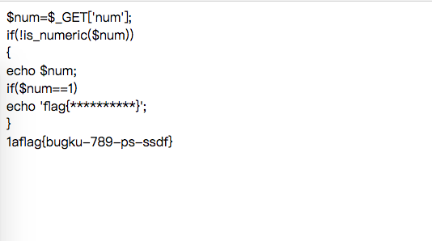

> 作为一名web开发者，安全是一道绕不开的关，下面十道题目是跟随囧途的e大提供的第一阶段练习题，特总结于此。废话不多少，直接看题

## 目标：寻找flag key
### 第一题（查看源码）
[第一题地址](http://120.24.86.145:8002/web2/)

初看是一片滑稽，是不是不知所措,一片滑稽，第一题的目的大概是为了告诉你，拿到任何网页，都要习惯性的查看它的源代码，养成惯性思维。

F12打开源码就显而易见了。


### 第二题（修改源码）
[第二题地址](http://120.24.86.145:8002/yanzhengma/)

第二题你会发现当你想输入结果的时候，只允许输入1个数字，这时候你经过第一题训练，你开始打开源码，然后你发现input属性上有个maxlength，限制了你的输入，这时候你稍加修改为2后

进行操作，点击确定，然后就发现了flag key..


这题考察的就是在查看源代码后能进行相应的修改，找出漏洞。让我想起读书时期，也是通过这种方法从何获取学校的流量来上网。。

### 第三题（GET）
[第三题地址](http://120.24.86.145:8002/get/)

访问后发现如下页面


如果你会php，这段代码应该很容易明白什么意思，就是这个的GET请求的what参数等于flag的时候，就会打印flag的值出来，我按照它的提示在地址后面加入
```？what=flag```点击回车，然后发现结果


### 第四题（POST）
[第四题地址](http://120.24.86.145:8002/post/)

依葫芦画瓢，根据第三题的模式如法炮制一遍，可是页面怎么主动发起一个post请求呢，这时候就推荐时候一个chrome插件--postman.专门用于测试请求的。我们打开postman发起一个post请求，就能得到结果



### 第五题（弱类型检查）
[第五题地址](http://120.24.86.145:8002/get/index1.php)

从页面提升之中，我们得到两个有效信息，num的参数不能数字，但是要等于1.乍一看仿佛此题无解，然后很多语言诸如javascript,php等属于弱类型语言，会进行强制类型转换。根据php弱类型的特点我们可以知道，如果一个数值和字符串进行比较的时候，会将字符串转换成数值。例如 “1a”转换成数字就是1，因此该在地址后面输入```?num=1a```就能得到结果



### 第六题
[第六题地址](http://120.24.86.145:8002/post/)


### 第七题
[第七题地址](http://120.24.86.145:8002/post/)


### 第八题
[第八题地址](http://120.24.86.145:8002/post/)


### 第九题
[第九题地址](http://120.24.86.145:8002/post/)


### 第十题
[第十题地址](http://120.24.86.145:8002/post/)